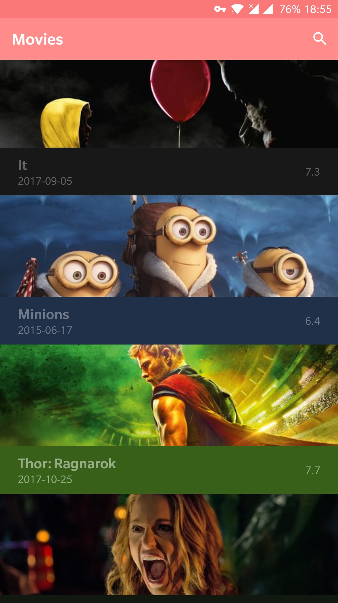
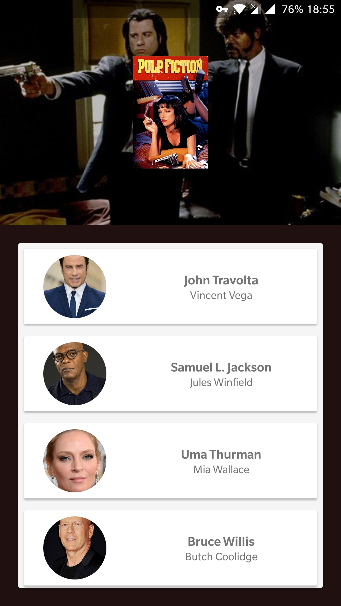
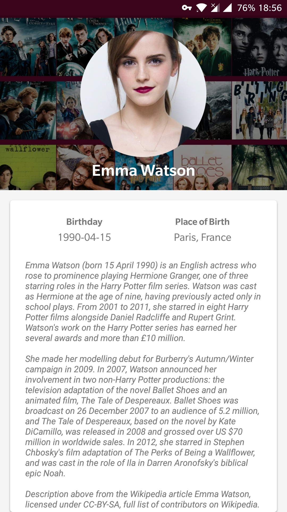
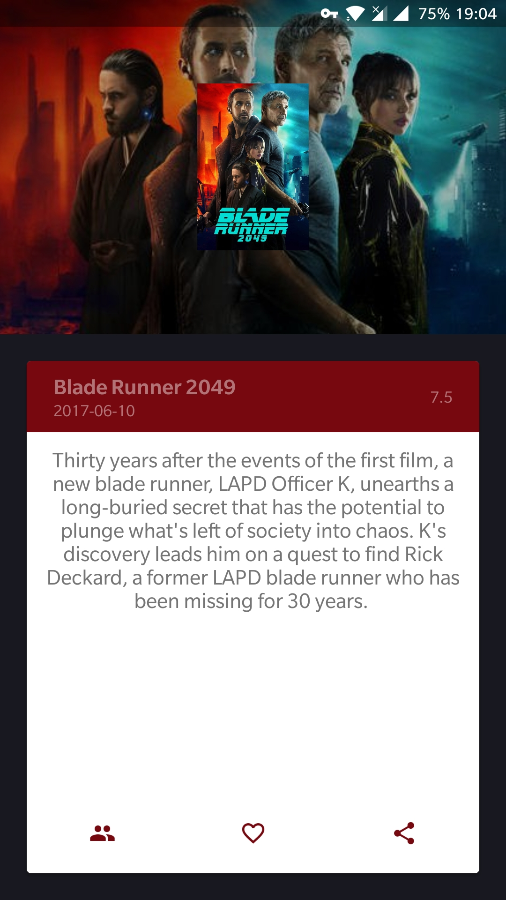

# Movies

A simple app to fetch data from TMDb. It's written in Kotlin and uses MVP architecture.

[Preview](https://media.giphy.com/media/3o6nV5RekSPgTCfvFe/source.mp4)

## Screenshots

 

## [Icon](https://www.flaticon.com/free-icon/video-camera_457754)
